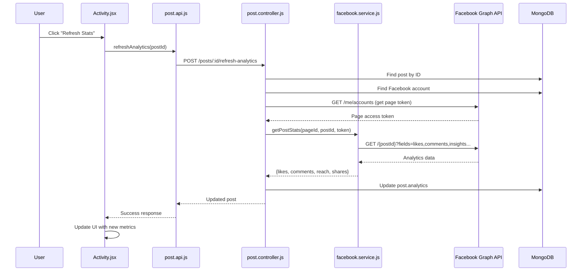

# Facebook Real-Tim

e Analytics Implementation

## Overview

Add real-time Facebook analytics fetching to display actual engagement metrics (likes, comments, reach, shares) from Facebook Graph API instead of static zeros.

## Current State Analysis

### What's Already Working:

- ✅ Post model has `analytics` field with `likes`, `comments`, `reach`, `shares` (defaults to 0)
- ✅ Post model has `publishedPlatforms[]` array with `platformPostId` field
- ✅ Facebook post ID is saved to `publishedPlatforms[].platformPostId` when publishing
- ✅ Frontend displays analytics from `post.analytics` object

### What's Missing:

- ❌ No function to fetch analytics from Facebook Graph API
- ❌ No endpoint to refresh analytics for a post
- ❌ Page ID not stored (needed for insights API)
- ❌ Frontend has no way to refresh analytics

## Implementation Steps

### Step 1: Update Post Model (Optional Enhancement)

**File:** [`backend/models/Post.model.js`](backend/models/Post.model.js)Add `pageId` field to `publishedPlatforms` schema to store the Facebook Page ID alongside the post ID. This makes it easier to fetch insights without parsing the post ID.

```javascript
publishedPlatforms: [{
  platform: String,
  platformPostId: String,
  pageId: String,  // NEW: Store Facebook Page ID
  publishedAt: Date,
  status: String,
  error: String
}]
```

**Note:** This is optional since we can extract pageId from postId format `{pageId}_{postId}`, but storing it explicitly is cleaner.

### Step 2: Update Publish Service to Save Page ID

**File:** [`backend/services/publish.service.js`](backend/services/publish.service.js)When publishing to Facebook, save the `pageId` returned from `postToFacebook`:

```javascript
// Line 93-98: Update to include pageId
post.publishedPlatforms.push({
  platform,
  platformPostId: publishResult.postId,
  pageId: publishResult.pageId,  // NEW: Save page ID
  publishedAt: new Date(),
  status: 'success'
});
```


### Step 3: Create Facebook Analytics Service Function

**File:** [`backend/services/facebook.service.js`](backend/services/facebook.service.js)Add new function `getPostStats(pageId, postId, accessToken)`:

```javascript
/**
    * Get Facebook post analytics/insights
    * @param {string} pageId - Facebook Page ID
    * @param {string} postId - Facebook Post ID (format: {pageId}_{postId})
    * @param {string} accessToken - Page Access Token (required for insights)
    * @returns {Promise<Object>} Analytics data with likes, comments, reach, shares
 */
export const getPostStats = async (pageId, postId, pageAccessToken) => {
  try {
    // Facebook Graph API endpoint for post insights
    const response = await axios.get(
      `https://graph.facebook.com/v19.0/${postId}`,
      {
        params: {
          fields: 'shares,likes.summary(true),comments.summary(true),insights.metric(post_impressions)',
          access_token: pageAccessToken
        }
      }
    );

    const data = response.data;
    
    return {
      likes: data.likes?.summary?.total_count || 0,
      comments: data.comments?.summary?.total_count || 0,
      shares: data.shares?.count || 0,
      reach: data.insights?.data?.[0]?.values?.[0]?.value || 0
    };
  } catch (error) {
    throw new Error(`Facebook analytics error: ${error.response?.data?.error?.message || error.message}`);
  }
};
```

**Important Notes:**

- Uses Page Access Token (not User Token) - required for insights
- Post ID format: `{pageId}_{postId}` (e.g., `123456789_987654321`)
- `insights.metric(post_impressions)` returns reach/impressions
- Handles missing data gracefully (defaults to 0)

### Step 4: Create Controller Method to Refresh Analytics

**File:** [`backend/controllers/post.controller.js`](backend/controllers/post.controller.js)Add `refreshPostAnalytics` function:

```javascript
import Account from '../models/Account.model.js';
import { getPostStats } from '../services/facebook.service.js';
import { postToFacebook } from '../services/facebook.service.js'; // For getting page token

export const refreshPostAnalytics = async (req, res) => {
  try {
    const userId = req.user._id;
    const postId = req.params.id;

    // Find the post
    const post = await Post.findOne({
      _id: postId,
      user: userId
    });

    if (!post) {
      return res.status(404).json({
        success: false,
        message: 'Post not found'
      });
    }

    // Check if post is published
    if (post.status !== 'published') {
      return res.status(400).json({
        success: false,
        message: 'Can only refresh analytics for published posts'
      });
    }

    // Find Facebook platform entry
    const facebookPlatform = post.publishedPlatforms.find(
      p => p.platform === 'facebook' && p.status === 'success'
    );

    if (!facebookPlatform || !facebookPlatform.platformPostId) {
      return res.status(400).json({
        success: false,
        message: 'No Facebook post found for this post'
      });
    }

    // Get Facebook account to retrieve access token
    const account = await Account.findOne({
      user: userId,
      platform: 'facebook',
      isActive: true
    });

    if (!account) {
      return res.status(400).json({
        success: false,
        message: 'No active Facebook account found'
      });
    }

    // Get Page Access Token (need to fetch pages to get page token)
    // We'll need to call the same logic as postToFacebook to get page token
    // For now, we can extract pageId from postId or use stored pageId
    
    const pageId = facebookPlatform.pageId || facebookPlatform.platformPostId.split('_')[0];
    const postIdOnly = facebookPlatform.platformPostId.includes('_') 
      ? facebookPlatform.platformPostId 
      : `${pageId}_${facebookPlatform.platformPostId}`;

    // Fetch pages to get page access token
    const pagesResponse = await axios.get('https://graph.facebook.com/v19.0/me/accounts', {
      params: {
        access_token: account.accessToken,
        fields: 'id,access_token'
      }
    });

    const selectedPage = pagesResponse.data.data.find(p => p.id === pageId) || pagesResponse.data.data[0];
    const pageAccessToken = selectedPage.access_token;

    // Fetch analytics from Facebook
    const analytics = await getPostStats(pageId, postIdOnly, pageAccessToken);

    // Update post analytics
    post.analytics = {
      likes: analytics.likes,
      comments: analytics.comments,
      reach: analytics.reach,
      shares: analytics.shares
    };

    await post.save();

    res.json({
      success: true,
      message: 'Analytics refreshed successfully',
      post
    });
  } catch (error) {
    res.status(500).json({
      success: false,
      message: error.message || 'Failed to refresh analytics'
    });
  }
};
```

**Note:** Need to import `axios` in controller if not already imported.

### Step 5: Add Route for Refresh Analytics Endpoint

**File:** [`backend/routes/post.routes.js`](backend/routes/post.routes.js)Add new route:

```javascript
import { refreshPostAnalytics } from '../controllers/post.controller.js';

// Add after other routes
router.post('/:id/refresh-analytics', refreshPostAnalytics);
```


### Step 6: Update Frontend API Client

**File:** [`social-media/src/api/post.api.js`](social-media/src/api/post.api.js)Add function to call refresh analytics endpoint:

```javascript
refreshAnalytics: async (postId) => {
  const response = await fetch(`${API_URL}/posts/${postId}/refresh-analytics`, {
    method: 'POST',
    headers: {
      'Authorization': `Bearer ${getToken()}`
    }
  });
  return response.json();
}
```


### Step 7: Update Activity Page Frontend

**File:** [`social-media/src/pages/Activity.jsx`](social-media/src/pages/Activity.jsx)Add "Refresh Stats" button and functionality:

1. Import `postAPI` and add state for loading/refreshing
2. Add refresh handler function
3. Add button next to analytics display
4. Optionally auto-refresh on mount for published posts
```javascript
import { postAPI } from '../api/post.api.js';

// Add state
const [refreshing, setRefreshing] = useState({});

// Add refresh function
const handleRefreshAnalytics = async (postId) => {
  setRefreshing(prev => ({ ...prev, [postId]: true }));
  try {
    const response = await postAPI.refreshAnalytics(postId);
    if (response.success) {
      // Update the post in context or refetch
      // You may need to update AppContext or refetch publishedPosts
    }
  } catch (error) {
    console.error('Failed to refresh analytics:', error);
  } finally {
    setRefreshing(prev => ({ ...prev, [postId]: false }));
  }
};

// Add button in the analytics section
{p.status === 'published' && (
  <div className="flex items-center gap-4 text-xs text-gray-600 mt-2">
    <span><i className="fas fa-eye text-blue-400" /> {analytics.reach?.toLocaleString() || 0} reach</span>
    <span><i className="fas fa-heart text-red-400" /> {analytics.likes || 0}</span>
    <span><i className="fas fa-comment text-blue-400" /> {analytics.comments || 0}</span>
    <button
      onClick={() => handleRefreshAnalytics(postId)}
      disabled={refreshing[postId]}
      className="ml-auto px-2 py-1 bg-blue-500 text-white rounded text-xs hover:bg-blue-600 disabled:opacity-50"
    >
      {refreshing[postId] ? 'Refreshing...' : 'Refresh Stats'}
    </button>
  </div>
)}
```


**Note:** May need to update AppContext to refresh publishedPosts after analytics update, or refetch posts after refresh.

## Data Flow Diagram




## Testing Considerations

1. **Test with actual Facebook posts** - Ensure the API returns real data
2. **Handle edge cases:**

- Post not found
- No Facebook account connected
- Post not published to Facebook
- Facebook API errors (rate limits, invalid tokens)

3. **Error handling:** Show user-friendly error messages
4. **Loading states:** Show spinner/disabled state while refreshing

## Future Enhancements

1. **Auto-refresh:** Periodically refresh analytics (e.g., every 5 minutes)
2. **Multi-platform:** Extend to Instagram and LinkedIn analytics
3. **Analytics history:** Store historical analytics data over time